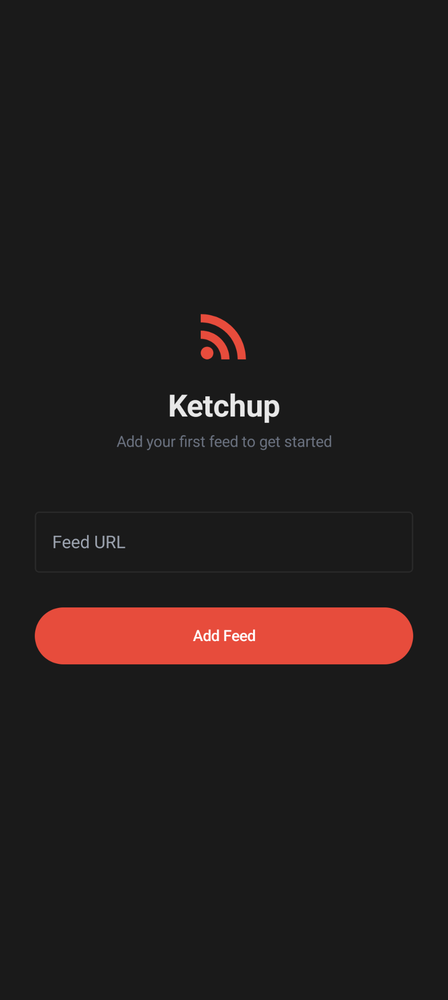
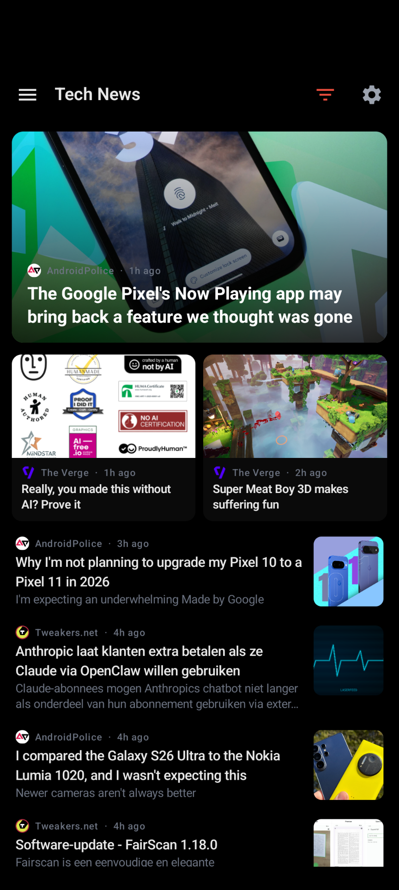
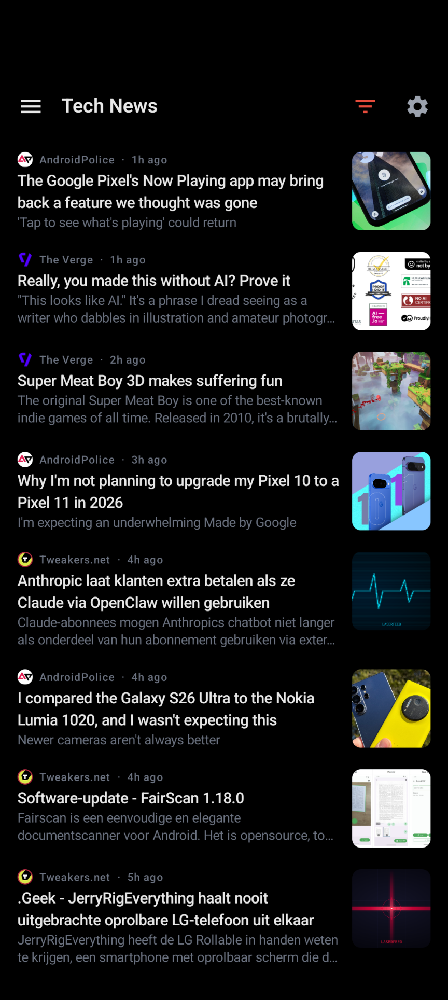
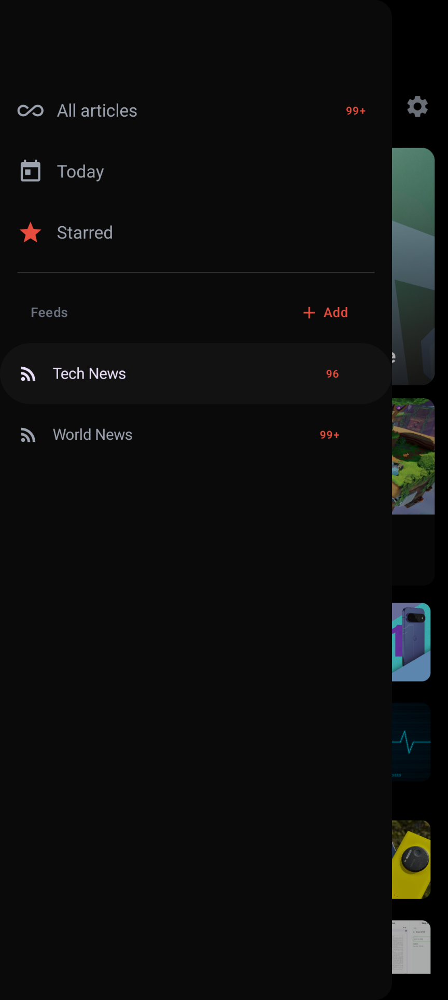
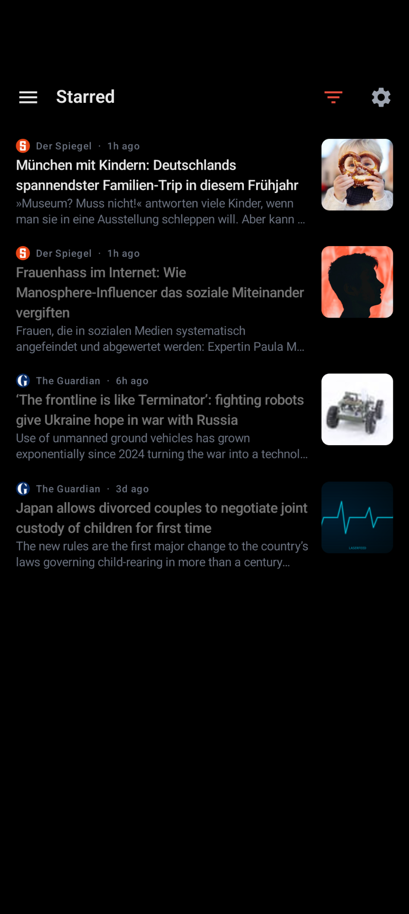
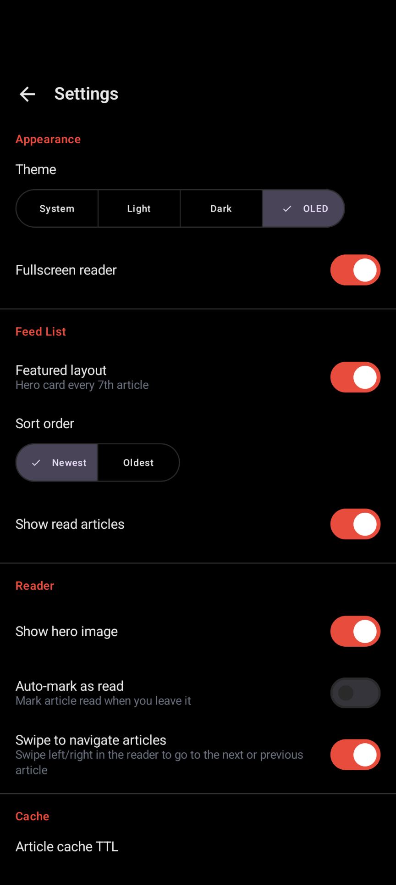
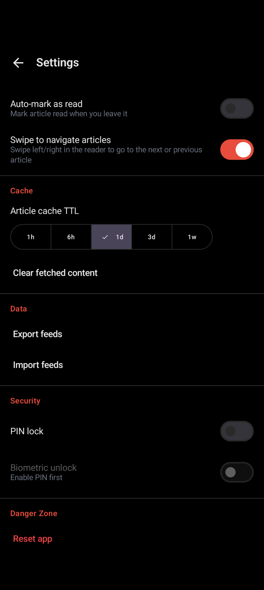

# Ketchup

**The feed reader where you catch up for the day.**

Ketchup is a native Android RSS/Atom reader built with Jetpack Compose. It is a fully standalone app that works with any standard RSS or Atom feed — and it is designed from the ground up to be the perfect mobile companion to [LaserFeed](https://github.com/laserfeed/laserfeed).

## LaserFeed + Ketchup

[LaserFeed](https://github.com/laserfeed/laserfeed) is a self-hosted feed aggregator with powerful per-feed filtering and named channel aggregations, each with its own Atom output. Ketchup is built to consume exactly that kind of output: subscribe to your LaserFeed channels as individual feeds in Ketchup, and your curated, filtered content lands directly in the reader — no noise, no algorithm, no tracking. Just the articles you wanted.

They are independent tools and work perfectly well on their own, but together they form a complete, self-hosted read-it-now pipeline: LaserFeed curates and aggregates on the server, Ketchup delivers it cleanly on your phone.

## Features

- **RSS 2.0 and Atom** — works with any standard feed, plus media/content extensions (media:thumbnail, content:encoded, dc:creator, enclosures)
- **Jetpack Compose UI** with Material 3 and OLED/dark/light/system theme support
- **Offline-first** — articles are cached locally via Room; read without a connection
- **Efficient sync** — HTTP conditional requests (ETag/Last-Modified) skip unchanged feeds
- **Article retention** — configurable per-feed article cap; starred articles are always kept
- **Featured layout** — optional hero card layout for a more magazine-like browsing experience
- **Article reader** — full-screen WebView reader with auto-hiding bars, hero image, and full-content fetch
- **Swipe navigation** — swipe left/right in the reader to move between articles
- **Feed management** — organize feeds into categories; filter the list by category, feed, today, or starred
- **Star articles** — save articles for later reading
- **PIN + biometric lock** — optional app lock with PBKDF2 PIN and fingerprint/face unlock
- **Import/export** — back up and restore your feed list as JSON

## Screenshots

<table>
  <tr>
    <td></td>
    <td></td>
    <td></td>
  </tr>
  <tr>
    <td></td>
    <td></td>
    <td></td>
  </tr>
  <tr>
    <td></td>
    <td></td>
    <td></td>
  </tr>
</table>

[See all screenshots →](docs/screenshots/)

## Installation

Ketchup is a sideload-only app — it is not distributed via the Play Store.

Download the latest signed APK from the [Releases](../../releases) page and install it directly on your device. You may need to enable "Install from unknown sources" in your Android settings.

## Building from source

### Requirements

- Docker and Docker Compose
- `make`

### Debug build

```sh
make build
# output/ketchup-debug.apk
```

### Release build

```sh
# 1. Copy and fill in signing credentials
cp .env.example .env

# 2. Generate a keystore (first time only)
make keystore

# 3. Build and sign
make build-release
make sign
# output/ketchup-signed.apk
```

### Install to a connected device

```sh
make install
```

## CI / GitHub Actions

Pushing a version tag triggers a full build, APK signing, and GitHub Release automatically.

```sh
git tag v1.0.0
git push origin v1.0.0
```

The workflow requires the following repository secrets:

| Secret | Description |
|--------|-------------|
| `KEYSTORE_BASE64` | Base64-encoded `.jks` keystore file |
| `KEY_ALIAS` | Key alias within the keystore |
| `KEYSTORE_PASSWORD` | Keystore password |
| `KEY_PASSWORD` | Key password |

## Tech stack

| Layer | Library |
|-------|---------|
| UI | Jetpack Compose + Material 3 |
| Navigation | Navigation Compose |
| HTTP | OkHttp 4 |
| Images | Coil 3 |
| Local storage | Room 2 |
| Article reader | AndroidX WebKit / WebView |
| Security | EncryptedSharedPreferences + BiometricPrompt |
| Build | Gradle 9 + AGP 9 + KSP |

## License

GNU General Public License v2.0 — see the [LICENSE](LICENSE) file for details.
